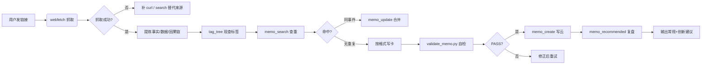

# flomo-note

> 极简云端卡片笔记技能 — 把网页、文章、想法整理成一条条 flomo memo，直接写入云端账号。

[](LICENSE)
[](https://www.python.org/downloads/)

---

## 项目是什么

flomo-note 是一个 AI 辅助的云端笔记技能，用于将看到的好内容高效沉淀为 **flomo 云端卡片**。

- **卡片形态** = 一行标签段 + 简短正文，一事一卡、标签聚合
- **本地不落盘**：笔记只存在于 flomo 云端账号，本地仅存放技能文档与工具脚本
- **自动化流程**：抓取 → 提炼 → 定标签 → 查重 → 写云 → 复盘，全程可复用

---

## 核心约定

1. **笔记只在云端** — 卡片正文仅存于 flomo 账号；本地 `d:\OpenClaw\flomo-note` 不落盘任何笔记内容
2. **本地只留工具** — 本目录仅存放技能文档（`SKILL.md`）、总则（`AGENTS.md`）与 MCP 配置（`.mcp.json`）
3. **写云需授权** — 建 memo、更新、改标签都在动手前展示内容并征得同意
4. **来源实实在在** — 卡片引用的 URL 必须真实、可核、经过抓取或核验
5. **细则听 SKILL** — 卡片格式、标签规则、流程执行铁律等以 `.kilo/skills/flomo-note/SKILL.md` 为准

---

## 快速开始

### 环境准备

```bash
# 克隆仓库
git clone https://github.com/shushuzn/flomo-note.git
cd flomo-note

# 配置 MCP token（本地文件，已 gitignore 不入库）
echo '{"mcpServers":{"flomo":{"url":"https://flomoapp.com/mcp","token":"fmcp_xxxxx"}}}' > .mcp.json
```

### 执行写卡

发送链接给 AI 助手，助手会自动执行 8 步 SOP：
1. **抓取** — webfetch 为主，SPA 补 curl
2. **提炼** — 滤营销话术，留事实/数据/因果链
3. **定标签** — `tag_tree` 现查，严格两级 `#顶层/二级`
4. **查重** — `memo_search` + `tag_tree` 逐条比对
5. **写作** — 按卡片格式落盘
6. **自检** — `validate_memo.py` EXIT=0 才许写云
7. **写云** — `memo_create` 直接写入
8. **复盘** — 三路现查，输出常规+创新建议

---

## 项目结构

```
flomo-note/
├── AGENTS.md                  # 项目总则（顶层目标与全局约定）
├── .kilo/skills/flomo-note/
│   └── SKILL.md               # 执行细则（唯一细则源）
├── scripts/
│   ├── flomo_client.py        # flomo MCP 调用封装
│   └── validate_memo.py       # 卡片格式自检脚本
├── .gitignore                 # 忽略本地敏感文件
└── README.md                  # 本文件
```

| 文件 | 职责 |
|------|------|
| `AGENTS.md` | 项目总则：顶层目标、核心约定、目录分工 |
| `SKILL.md` | 执行细则：卡片格式、标签规则、SOP 流程、铁律 |
| `flomo_client.py` | MCP 工具封装：`memo_create` / `memo_update` / `tag_search` / `tag_tree` 等 |
| `validate_memo.py` | 卡片格式自检：标签层级、必填字段、URL 真实性 |

---

## 卡片格式

```markdown
#标签/细分

结论先行，直接写结论句。

要点：
- 要点一（依据）
- 要点二

状态：<状态>/<指标>（可选）

来源: https://真实来源
```

### 标签规则

- 首行标签段，多个 `#标签` 空格分隔，**每个带 `#`**
- **严格两级**：`#顶层/二级`（例：`#科技/算力硬件` `#AI/开源模型`）
- 禁止三级及以上：`#科技/安全/邮件认证` 非法
- 新标签前先 `memo_search` + `tag_tree` 现查近邻确认无既有簇

---

## 脚本工具

### flomo_client.py

```bash
# 列出标签树
python scripts/flomo_client.py tag_tree

# 搜索 memo
python scripts/flomo_client.py memo_search --query "关键词"

# 新建 memo（从 JSON 文件读取）
python scripts/flomo_client.py memo_create --file create.json

# 更新 memo（覆盖式）
python scripts/flomo_client.py memo_update --file update.json
```

### validate_memo.py

```bash
# 从文件读取并自检
python scripts/validate_memo.py memo_body.txt

# 从命令行参数读取
python scripts/validate_memo.py --content "#标签/细分\n\n正文..."

# 从 create.json 读取
python scripts/validate_memo.py --create create.json
```

**自检通过标准**：EXIT=0，输出 `0 ERR / 0 WARN`

---

## 工作流示例



---

## 安全须知

- `.mcp.json` 含个人 Bearer token，已加入 `.gitignore`，**不会入库**
- 云端无删除 API（`memo_delete` 不存在），删除卡片只能在 flomo App 手动完成
- 清空卡片 = `memo_update(content=' ')`，会同时清空标签，需授权后再执行

---

## License

MIT License — 见 [LICENSE](LICENSE) 文件
