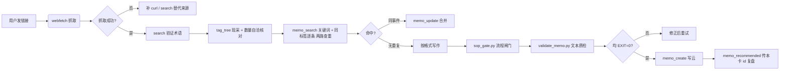

# flomo-note

> 极简云端卡片笔记技能 — 把网页、文章、想法整理成一条条 flomo memo，直接写入云端账号。

[](LICENSE)
[](https://www.python.org/downloads/)

---

## 项目是什么

flomo-note 是一个 AI 辅助的云端笔记技能，用于将看到的好内容高效沉淀为 **flomo 云端卡片**。

- **卡片形态** = 一行标签段 + 概念名称行 + 正文，一事一卡、标签聚合
- **本地不落盘**：笔记只存在于 flomo 云端账号，本地仅存放技能文档与工具脚本
- **流程机械化**：抓取 → 验证 → 提炼 → 定标签 → 查重 → 写作 → 自检 → 复盘 → 写云；其中验证/核对/查重/复盘由流程闸门脚本强制留痕，漏做无法通过自检

---

## 核心约定

1. **笔记只在云端** — 卡片正文仅存于 flomo 账号；本地不落盘任何笔记内容
2. **本地只留工具** — 本仓库仅存放技能文档（`SKILL.md`）、总则（`AGENTS.md`）、环境说明（`ENVIRONMENT.md`）与工具脚本（`scripts/`）
3. **写云免确认** — 建 memo、更新正文、清空空白卡、改标签一律免确认，抓取 → 查重 → 自检 EXIT=0 后直接写云（细则以 `SKILL.md` 执行铁律为准）；只有物理删除须明确授权，而 flomo 无删除 API，只能用户在 App 手动删
4. **来源实实在在** — 写作依据必须真实抓取并读回正文；抓取失败且无替代来源时禁止写云
5. **卡内无来源** — 正文（含概念名括号、要点句内）不得出现任何来源 / 通报方 / 发布渠道 / 载体信息，一律删除；唯一豁免是作为处分依据的法规名（细则见 `SKILL.md` H15/H16）
6. **细则听 SKILL** — 卡片格式、标签规则、流程执行铁律等以 `SKILL.md` 为准；环境事实以 `ENVIRONMENT.md` 为准

---

## 快速开始

### 环境准备

```bash
# 克隆仓库
git clone https://github.com/shushuzn/flomo-note.git
cd flomo-note

# 配置 MCP token（本地文件，已 gitignore 不入库）
# 结构见 scripts/flomo_client.py 的 load_token()：mcpServers.flomo.headers.Authorization
cat > .mcp.json <<'JSON'
{"mcpServers":{"flomo":{"url":"https://flomoapp.com/mcp",
  "headers":{"Authorization":"Bearer fmcp_xxxxx"}}}}
JSON
```

> token 解析优先级：`.mcp.json` 优先，环境变量 `FLOMO_TOKEN` 仅作后备。**两处都没有时，所有脚本命令都会以非 0 退出并打印「未找到 flomo token」**——看到该提示即说明下面所有示例都还没到执行阶段。

### 执行写卡

发送链接给 AI 助手，助手按 9 步 SOP 执行：

1. **抓取** — webfetch 为主，SPA 补 curl；抓回即读回正文
2. **验证** — 专业术语/机构/产品/模型简称必须 `search` 现查（阻塞；结果留痕 `verify.json`）
3. **提炼** — 滤营销话术，留事实/数据/因果链
4. **定标签** — `tag_tree` 现采，严格两级 `#顶层/二级`（含数量自洽核对，阻塞）
5. **查重** — `memo_search` 关键词 + `tag_tree` 同主标签逐条比对，两路并查（阻塞）
6. **写作** — 按卡片格式写作
7. **写云前自检** — 先过流程闸门 `sop_gate.py`，再过文本质检 `validate_memo.py`，均 EXIT=0 才许写云（阻塞）
8. **复盘** — 三路现查（`memo_search` + `tag_tree` + `memo_recommended` 传本卡 id）
9. **更新云端** — `memo_update` 覆盖式或 `tag_rename`

---

## 项目结构

```
flomo-note/
├── AGENTS.md                  # 项目总则（顶层目标与全局约定）
├── SKILL.md                   # 执行细则（唯一细则源）
├── ENVIRONMENT.md             # 运行环境事实（路径、代理、通道）
├── web/                       # 项目控制台前端（Claude 风格，静态资源）
│   ├── index.html
│   ├── styles.css
│   └── app.js
├── scripts/
│   ├── memo_util.py           # 签名/指纹/关键词/标签树快照 唯一实现
│   ├── flomo_client.py        # flomo MCP 调用唯一入口
│   ├── sop_gate.py            # SOP 流程闸门（代跑核对/查重/复盘，出凭证）
│   ├── validate_memo.py       # 写云前文本质检 + 闸门凭证校验
│   ├── tag_tree_sync.py       # 标签树快照现采重写与核对
│   ├── check_skill_docs.py    # 技能文档内容纪律自检
│   ├── sni_fetch.py           # SNI 被阻断时的取件通道
│   ├── extract_arxiv_html.py  # arXiv HTML 正文抽取
│   ├── cleanup.py             # 收尾强制清理残留（文件与目录）
│   ├── git_tunnel.py          # GitHub 本地透传通道
│   ├── push_skill.sh          # 文档改动强制推送
│   ├── serve_console.py       # 控制台本地服务（静态文件 + JSON 接口）
│   ├── console_cloud.py       # 控制台云端只读访问（白名单 / 字段精简）
│   ├── console_data.py        # 控制台本地数据抽取（供上面两者共用）
│   ├── run_audit.sh / audit_skill.sh    # 技能文档结构审计
│   ├── run_tests.sh           # 一键跑全部离线回归
│   └── test_*.py              # 各脚本配套回归用例
├── .gitignore                 # 忽略凭据与现采缓存
└── README.md                  # 本文件
```

| 文件 | 职责 |
|------|------|
| `AGENTS.md` | 项目总则：全局约定与收口原则 |
| `SKILL.md` | 执行细则：卡片格式、标签规则、SOP 流程、硬限清单（H1–Hn） |
| `ENVIRONMENT.md` | 环境事实：平台、路径、token 来源、代理与推送通道 |
| `memo_util.py` | 卡片签名 / 正文指纹 / 检索关键词 / 标签拆分的唯一实现 |
| `sop_gate.py` | 流程闸门：代跑标签树核对 / 查重两路 / 复盘三路，校验验证留痕 |
| `validate_memo.py` | 文本质检（格式、标签、来源、载体、字数）+ 闸门凭证校验 |
| `serve_console.py` + `web/` | 项目控制台：本地服务 + Claude 风格前端（云端笔记 / 标签树） |
| `console_cloud.py` | 控制台读云：只读工具白名单、卡片字段精简、连接与失败处理 |
| `console_data.py` | 控制台读仓库：解析标签树快照与统计字段 |

---

## 项目控制台

控制台只做两件看的事：**云端笔记**（主视图）与**标签树**。

- **云端笔记**：只读浏览 flomo 云端的卡片——关键词搜索、按标签筛、点开读全文、今日回顾；
- **标签树**：本地快照的分组速览，计数与流程闸门同源（一律走 `memo_util`）。

```bash
python scripts/serve_console.py            # 启动，默认 http://127.0.0.1:8787
python scripts/serve_console.py --open     # 启动后自动开浏览器
python scripts/serve_console.py --port 9000
```

> 服务在启动那一刻加载脚本模块，**改了脚本要重启进程才生效**。端口已被占用时启动会
> 直接报错退出：两个实例同时监听同一端口会让页面内容时新时旧，极难排查。

页面按需拉 `/api/*`：

| 接口 | 内容 |
|------|------|
| `/api/cloud/memos` | 云端卡片列表：`keywords` 搜索、`tag` 按标签筛、`limit` 限条数（无参即最近） |
| `/api/cloud/memo` | 按 `id` 取单卡全文（列表里的正文可能被云端截断） |
| `/api/cloud/review` | 今日回顾 |
| `/api/overview` | 统计字段与云端可用性 |
| `/api/tagtree` | 标签树分组速览 |

接口只列界面实际会用的这几路，**没有任何执行命令或写数据的入口**（服务里连 POST 处理都不存在）。

`tag` 参数须给**完整标签路径**（如 `AI/RAG`）：云端不接受裸顶层名（传 `AI` 查不到）。
单次返回条数受云端上限约束（上限值由接口给出），到顶时界面会提示改用关键词或标签继续筛。

云端访问全部收敛在 `console_cloud.py`，三条边界：

- **只读白名单**：只允许调用列出的只读工具；写工具（建卡 / 更卡 / 改标签）与白名单外的
  任何工具名一律拒调用——控制台在结构上不可能写云；
- **不落盘**（H26）：卡片正文只在进程内存与 HTTP 响应之间传递，不写文件、不写缓存、
  不写访问日志；每次请求重新现采云端；
- **token 不出进程**：凭证只在建连时使用，响应里只有「可用 / 不可用」这一事实。

标签树的**计数口径与闸门同源**（一律走 `memo_util`），控制台不另实现一份，
避免出现「界面显示的数量与闸门口径不一致」这类漂移。

---

## 卡片格式

```markdown
#标签/细分

概念名称

直接写结论句，不带任何模板前缀。

要点：
- 要点一（依据）
- 要点二
```

**硬性要求**：

- 首行标签段，**第二行是概念名称**（简明名词/概念），空一行后接正文
- 结论直接作正文首句，禁止「结论先行：」等模板前缀回显
- **不写来源、不写状态**：无 `来源：` / `状态：` 行，正文任何位置也不得以句子形式夹带来源 / 通报方 / 载体信息
- 单卡正文（含标签段）不超过 20000 字

### 标签规则

- 首行标签段，多个 `#标签` 空格分隔，**每个带 `#`**
- **严格两级**：`#顶层/二级`（例：`#科技/机器人` `#AI/物理AI`）
- 禁止三级及以上：`#科技/安全/邮件认证` 非法
- 新标签前先 `memo_search` + `tag_tree` 现查近邻确认无既有簇

---

## 脚本工具

### flomo_client.py

```bash
# 列出标签树（须拿全量）
python scripts/flomo_client.py tag_tree --file tag_tree_args.json   # {"limit":2000}

# 搜索 memo（参数为 JSON，形如 {"keywords":"...","limit":10}）
python scripts/flomo_client.py memo_search --file search.json

# 新建 memo（参数 {"content":"...","format":"markdown"}）
python scripts/flomo_client.py memo_create --file create.json

# 更新 memo（覆盖式，参数 {"id":"...","content":"..."}）
python scripts/flomo_client.py memo_update --file update.json

# 读全文（参数 {"ids":["..."]}）
python scripts/flomo_client.py memo_batch_get --file read.json
```

> 参数一律以 JSON 传入（`--file <路径>` 或内联 JSON 字符串），避免中文引号被转全角。

### sop_gate.py（流程闸门）

```bash
# 术语卡：须先备好 verify.json（第 2 步网络搜索留痕）
python scripts/sop_gate.py --memo memo_body.txt --verify verify.json
# 更新场景可加 --anchor-id <本卡 id> 作推荐锚点
# 确认非术语卡：用 --skip-web 替代 --verify（凭证中留痕 web_skipped）
```

闸门会代跑标签树数量核对、查重两路、复盘三路，全过后在 `.sop_gate/` 落一份带**正文指纹**的凭证。退出码非 0 即未过，禁写云。

### validate_memo.py

```bash
# 从文件读取并自检
python scripts/validate_memo.py memo_body.txt

# 从命令行参数读取 / 从 JSON 读取 content
python scripts/validate_memo.py --content "#标签/细分\n\n概念名\n\n正文..."
python scripts/validate_memo.py --create create.json

# 特殊场景降级（闸门问题转 WARN，常规写卡禁用）
python scripts/validate_memo.py --no-gate memo_body.txt
```

**自检通过标准**：EXIT=0（0 ERR）。闸门凭证缺失 / 签名不符 / 正文指纹不符 / 已过期 / 验证未执行，任一情形判 ERR 阻断写云。

---

## 工作流示例


```mermaid
graph LR
    A[用户发链接] --> B(webfetch 抓取)
    B --> C{抓取成功?}
    C -->|否| D[补 curl / search 替代来源]
    C -->|是| E[search 验证术语]
    E --> F[tag_tree 现采 + 数量自洽核对]
    F --> G[memo_search 关键词 + 同标签逐条 两路查重]
    G --> H{命中?}
    H -->|同事件| I[memo_update 合并]
    H -->|无重复| J[按格式写作]
    J --> K[sop_gate.py 流程闸门]
    K --> L[validate_memo.py 文本质检]
    L --> M{均 EXIT=0?}
    M -->|否| N[修正后重试]
    M -->|是| O[memo_create 写云]
    O --> P[memo_recommended 传本卡 id 复盘]
```

---

## 安全须知

- `.mcp.json` 含个人 Bearer token，已加入 `.gitignore`，**不会入库**
- 云端无删除 API（`memo_delete` 不存在），删除卡片只能在 flomo App 手动完成
- 清空卡片 = `memo_update(content=' ')`，属常规写云动作、免确认执行；会连带置空该卡标签，只挂在它上面的独占标签会从标签树消失——引用标签簇名前须现采 `tag_tree`

---

## License

MIT License — 见 [LICENSE](LICENSE) 文件
